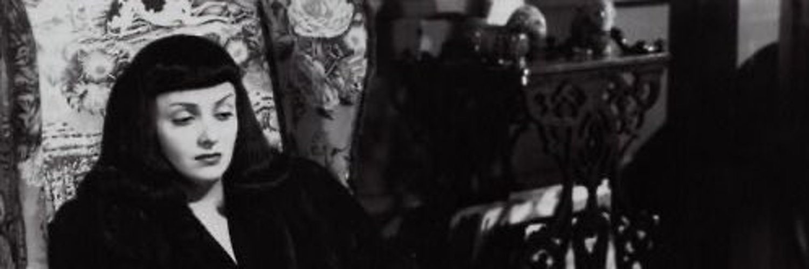

# Horror-Slitscan


*A generative audiovisual artwork that turns horror trailers into abstract slit-scan traces and reactive sound.*

<div align="center">
  
</div>

## About

Horror-Slitscan is a web-based generative art piece built around the ideas of **contaminated media** and **found footage**. The user picks a film noir-era horror trailer (*The Seventh Victim*, *The Haunting* or *Cat People*) and the system strips away its narrative, dialogue and soundtrack, keeping only **luminance data**. That data drives a new abstract visual surface and a synthetic soundscape, shifting focus from storytelling to mood, texture and distortion.

Interaction is intentionally restrained: the user's only agency is selection. Once a film is chosen, the system runs autonomously and the user becomes an observer.

---

## Technologies

- **HTML / CSS / JavaScript** for the interface, styling and pixel-level video processing
- **[p5.js](https://p5js.org/)** and **p5.sound** for canvas rendering, filters, reverb and oscillator
- **Node / npm** for dependency management

**Credits:** [metal drone](https://freesound.org/people/newlocknew/sounds/677682/) by newlocknew and [choir ambience](https://freesound.org/people/kevp888/sounds/657924/) by kevp888 (Freesound); [goth cursor](https://www.rw-designer.com/cursor-detail/13355) by Caleb (RW-Designer); slit-scan approach informed by [Form+Code](https://formandcode.com/code-examples/transform-slit-scan).

---

## Features

**Real-time slit-scan visuals**
- Three vertical slits (25%, 50%, 75% of the frame width) are sampled from every video frame and converted to greyscale luminance.
- Each slit is written to the canvas as a narrow column, so the canvas accumulates a continuous trace of the film. A faint line marks the current scan position.

**Reactive sound engine**
- A looping choir and metal drone pass through a custom audio graph (low-pass, high-pass, shared reverb), with a silent sine oscillator providing low-frequency modulation.
- Brightness drives the sound in real time, with all values smoothed using `lerp`:

| Visual input | Audio parameter |
|--------------|-----------------|
| Centre slit | Crossfade between choir and drone |
| Left slit | Choir playback speed |
| Right slit | Drone playback speed and volume (darker = louder) |
| Overall brightness | Low-pass cutoff and reverb wet/dry mix |

**Interface**
- Film selection cards with looping, muted previews
- Save button to export the canvas as an image, and a return arrow that fades back to the landing screen
- Custom cursor and blood-splatter overlay (stylistic only)

---

## The Process

The project developed iteratively. Early experiments with GAN-generated film stills, waveform visualisations and multi-panel layouts were dropped: the GAN workflow was too heavy for real-time use, and multi-panel layouts fragmented the experience. The real-time slit-scan became the core framework. Image and sound were then unified so that different regions of the source drive separate sonic functions, and user controls were deliberately removed to favour observation over manipulation.

**Future work:** a larger archive, varied sound design per film, and audio export alongside the image.

---

## Running the Project

1. Click **Code → Download ZIP** on this repository and extract it.
2. Open the extracted folder in a terminal.
3. Install dependencies and start the dev server:
   ```bash
   npm install
   npm run dev
   ```
4. Open the local address shown in the terminal and pick a film. Audio starts after your first click, as browsers require a user gesture.

---

## Preview

> Replace the paths below with your own screenshots or GIFs.


